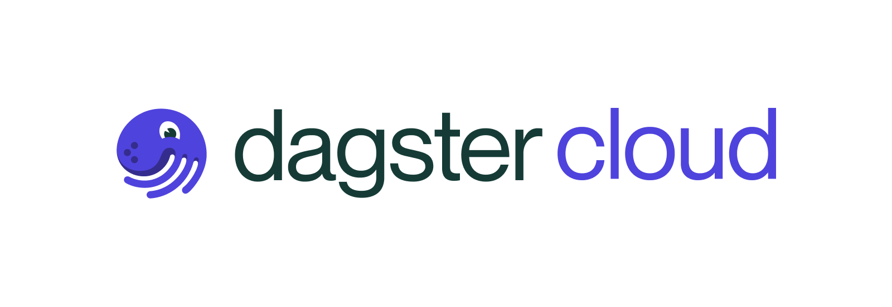

<p align="center">

<br /><br />
<a href="https://badge.fury.io/py/dagster-cloud"></>
<a href="https://dagster-slackin.herokuapp.com/"></a>
</p>

# Dagster Cloud

Unify all your data tools into a productive, enterprise-grade platform. Sign up for early access to
Dagster Cloud at https://dagster.io/cloud.

## Demo

https://user-images.githubusercontent.com/16431325/145064683-3df130f9-57e3-4477-9c47-168f97fc2544.mp4

## Getting Started

### Installation

The Dagster Cloud Agent library is available in PyPi:

```
$ pip install dagster-cloud
```

Dagster Cloud is currently in [Early Access](https://dagster.io/blog/introducing-dagster-cloud).
You can join our [waitlist](https://www.dagster.io/cloud), read our [documentation](https://docs.dagster.cloud/), or reach out to us in Slack:

<br />
<p align="center">
<a href="https://join.slack.com/t/dagster/shared_invite/enQtNjEyNjkzNTA2OTkzLTI0MzdlNjU0ODVhZjQyOTMyMGM1ZDUwZDQ1YjJmYjI3YzExZGViMDI1ZDlkNTY5OThmYWVlOWM1MWVjN2I3NjU"></a>
</p>
